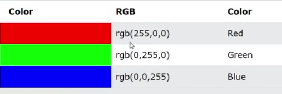
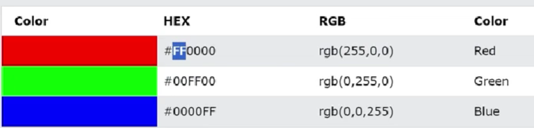
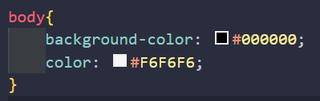
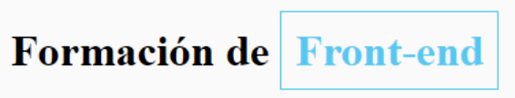

# Colores en Css
como vemos en css cada color tiene un numero o denominacion diferente pero
a que se deben estos numeros y es la unica manera de denotarlos? 

Podemos colocarlos de la misma manera como hicimos para dar color a nuestro fondo, es decir, colocando su nombre, por ejemplo: black, blue, red, etc. 

pero que pasa si queremos un color en especifico como por ejemplo los colores que 
tiene nuestro diseño en Figma? 

## RGB colores
el nombre RGB indica Red, Green, Blue
y usa estos mismos 3 colores en diferentes intensidades para crear los diferentes 
colores que hay 

la escala de cada color va del 0 al 255:


vemos la intensidad mas fuerte de cada color

## Hexadecimal colores
esta es otra forma de ver nuestros colores: 
tenemos 6 digitos

#RRGGBB 
los primeros dos son para el rojo, los otros dos para el verde y los ultimos dos para el azul 




en este caso la escala de intensidad va de 00 hasta ff que es el maximo

y porque es de esta forma? 
tenemos aqui una regla especial de intervalos 

tenemos dos digitos
en el primer digito empezamos primero con los numeros del 0 al 9 y despues en el segundo digito van tambien los numeros del 0 al 9 luego que llega al 9 pasa a las letras de la a hasta la f 

por ejemplo 
10-11-12-13-14-15-16-17-18-19-1a-1b-1c-1d-1e-1f-20-21... 

esto se aplica para cada uno de los 3 colores y hacer combinaciones de muchos tipos 

en nuestro caso el color de nuestro fondo y de las letras seria asi 


y ahora si tenemos los colores originales, pero nos falta un detalle, el resaltado de azul de la frase 

### Resaltado de letra
recordemos que el resaltado lo indicabamos con `strong` 
```css
strong{
    color:#22D4FD
}
```
Y listo pero, esto se aplicara a todo lo que se quiera resaltar con strong, como hacemos para que nuestras letras puedan tener diferentes colores? 
para esto usamos las clases css que veremos en el siguiente curso

hay otra etiqueta que también se utiliza mucho para esto, que es la etiqueta **`<span>`**. A diferencia de `<strong>`, `<span>` no aplica negrita por defecto, pero es una excelente forma de resaltar partes del texto en HTML. Mira:

```html 
HTML
<h1>Formación de <span>Front-end</span></h1>

```
```css
CSS

h1{
    font-weight: bold;
}

span{
    color: #22D4FD;
    border: 1px solid #22D4FD;
    padding: 10px;
}
```

Explicando el código anterior:

`font-weight: bold;` (Texto en negrita)

`color: #22D4FD;` (Color del texto azul)

`border: 1px solid #22D4FD;` (Borde con 1 px de ancho, de tipo sólido y color del borde azul)

`padding: 10px;` (Espaciado interno de 10px)

RESULTADO:




