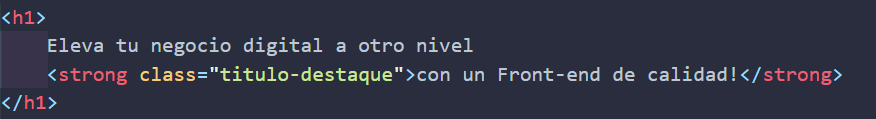
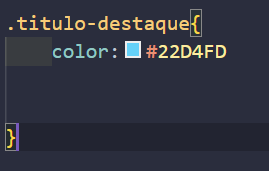

# Clases en Css
Que podemos hacer para darle caracteristicas diferentes a una etiqueta y a otra?

Usamos **clases** 

miremos este ejemplo
queremos darle un strong de color diferente a nuestro parrafo que a nuestro titulo que esta en azul, 

Que hacemos? 
usamos la etiqueta **`class`**
la incluimos dentro de la etiqueta de apertura de strong
y le damos un nombre que la diferencie
ejemplo:

ahora tomamos ese nombre que le dimos a la clase y nos vamos a CSS
aqui lo que haremos sera nombrar la clase para configurarla 
pegamos nuestro nombre y antes de este debe ir un punto (.)

y listo abrimos corchetes y le damos el color que queremos a nuestra letra
ejemplo: 

