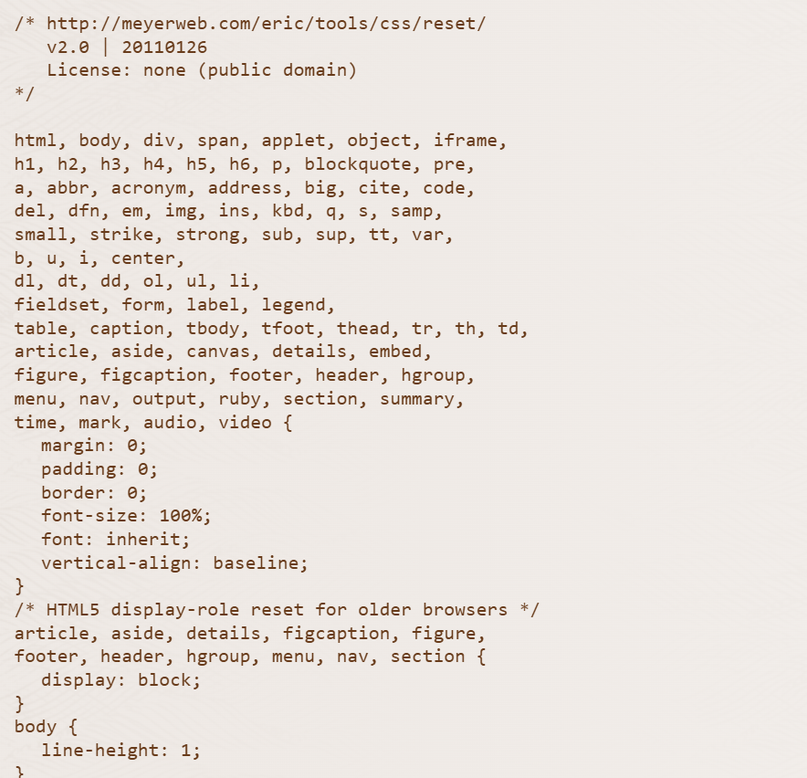

# El Box model
Si le damos a inspeccionar a nuestra pagina y seleccionamos un elemento en especifico
vemos que esta rodeado de una especie de borde de color en este caso marron y vemos abajo en la derecha el *Box model* el cual es un modelo de lo que contiene cada elemento de nuestra pagina 

por ejemplo

 como vemos la parte azul seria el elemento en si (el titulo) despues tenemos un padding que seria el espacio entre el contenido y el borde de este, despues viene el borde que en este caso no tiene, y luego viene el margen que es lo marron que vemos arriba 

##### Pero para que nos sirve este box model? 
Resulta que no en todos los navegadores nuestra pagina se vera igual, puede ser que en microsoft edge nuestro titulo tenga un padding o un border diferente en su box model

entonces es aca cuando entra el **reset css**

# Reset css
esto es creado para que podamos homogeneizar nuestros elementos para que en todos los navegadores se vea igual

es un codigo de css que reinicia todo el patron o estilo de nuestras etiquetas

miremos este ejemplo de un reset css:

Pero.. nosotros no estamos usando tantas etiquetas entonces que hacemos que podemos hacer? 

podemos ir a nuestro propio archivo de style.css y hacer los cambios manualmente 

como recordamos en nuestro box model anterior nosotros no estabamos utilizando como tal el padding y el margen, estaban simplemente ocupando espacio, por lo tanto vamos a sacarlos
ademas estos son los elementos que por lo general cambian entre navegadores asi que siempre debemos resetearlos a 0

usamos un asterisco (*) que quiere decir que vamos a hacer un cambio general en todo nuestro HTML, abro corchetes y decimos lo que queremos cambiar 

y listo ahora miremos como ha cambiado la pagina 

se ven las cosas mas pegadas y si inspeccionamos vemos que se encuentra el borde azul indicando que solo esta el elemento 

pero... que pasa si un elemento no ocupa el espacio necesario y queremos ampliarlo? miremos en el siguiente capitulo -> 5.2a Height y box-sizing
    