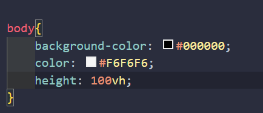
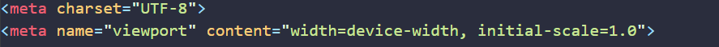
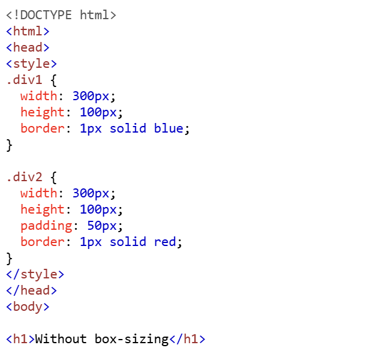
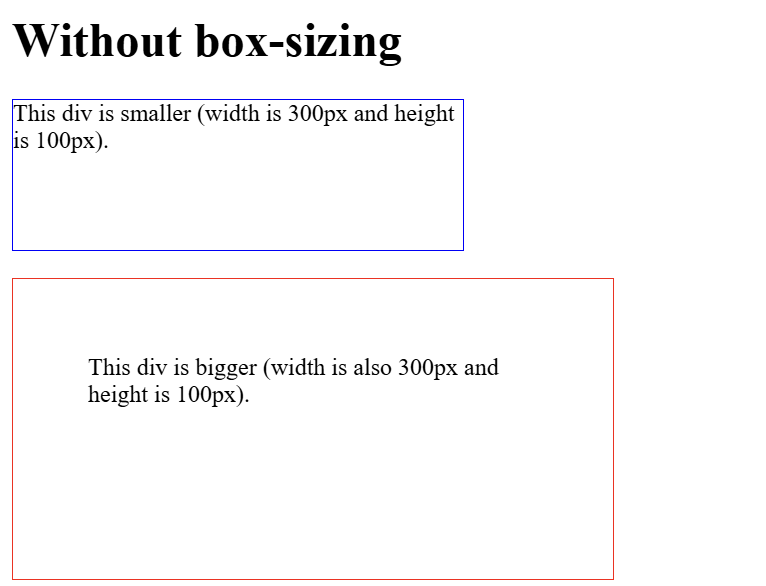
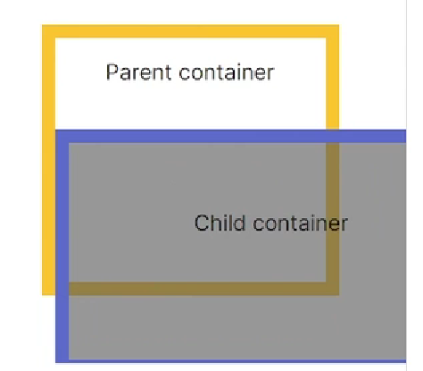
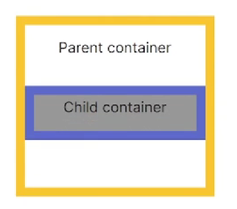

# Ampliar un elemento en el box model
para este caso miremos que nuestro body no esta ocupando todo la pantalla de la pagina, cosa que no queremos, entonces vamos a nuestro css y ponemos dentro de los corchetes de body el **`height`**

entonces analicemos esto:
* Que es el vh? 
significa viewport height, si recordamos, en nuestro html habiamos escrito en meta lo siguiente 

miremos que aparece el viewport que quiere decir el area visible de la pagina, todo lo que se ve en la pantalla 
 
    Si defines un elemento con height: 100vh, esto significa que ocupará exactamente el 100% de la altura visible del navegador, independientemente del tamaño del contenido o del dispositivo. 
 
    ***Quiere decir que con esta propiedad estamos diciendo que queremos que, por ejemplo, nuestro body se ajuste al 100 por ciento de nuestro viewport y como anteriormente hemos configurado nuestro viewport para que ocupe toda la pantalla del dispositivo entonces nuestro body tambien lo hara***

### Usos y fines del `height`
**Establecer altura fija:**
Define una altura exacta en píxeles, porcentajes, o unidades relativas (como em o rem).

**Altura relativa al contenedor:**
Usar porcentajes (%) para que el elemento se ajuste a la altura de su contenedor padre.

**Ajustar al viewport:**
Usar vh para ocupar un porcentaje de la altura visible del navegador.

**Controlar desbordamientos:**
Define límites de altura para gestionar el contenido interno, combinado con overflow.

**Diseñar secciones completas:**
Define la altura de elementos estructurales como header, footer o sections.

**Diseño responsivo:**
Junto con min-height y max-height, ajusta el tamaño de los elementos en diferentes pantallas.

**Crear efectos visuales:**
Usar con animaciones o transiciones para efectos como expansión/colapso.

**Uniformidad en botones y campos:**
Garantiza que elementos interactivos tengan tamaños consistentes.

----
## Box sizing

ahora retomando el *body*, sabemos que este es todo el contenido que se puede ver en la pagina, y tiene unos elementos contenidos como el h1 los cuales son elementos hijos de este elemento padre, pero hay ocasiones donde el elemento hijo se quiere escapar del elemento padre entonces que hacemos? 

Usamos el **box-sizing**

Primero que todo pensemos, como se define la anchura y la altura de un elemento? 
usamos la siguiente formula:

**Anchura**
`
width + padding + border = actual width of an element`

**Altura**
`height + padding + border = actual height of an element`

miremos este ejemplo de como se veria nuestros elementos **SIN BOX SIZING:**

miremos estos divs, el div1 tiene width, height y border pero ***no tiene padding***

en cambio el div2 si tiene un padding de **50px**

sabemos que el padding es el espacio entre el border y el elemento entonces miremos como se ve

vemos que el div2 claramente es mas grande porque segun la formula la anchura total y la altura total cambian con el padding, tendria 50px hacia arriba, abajo y a los lados mas que el otro que no tiene padding

y como solucionamos esta diferencia?
para eso existe el boxsizing

Esta propiedad contiene 2 valores:

1. content box
2. border box

Imaginemos que estamos construyendo **una casa**, donde **el body de nuestra página web es la estructura principal de la casa**. Así como una casa tiene paredes que la delimitan, **el body define el espacio donde todos los elementos de nuestra página vivirán**.

Ahora, pensemos en los elementos hijos, como los muebles dentro de la casa. Si no tenemos cuidado, algunos muebles pueden sobresalir de la casa, lo que sería como si los elementos hijos se salieran del body. Para evitar esto, utilizamos la propiedad **box-sizing**, que **actúa como un marco que asegura que todos los muebles (elementos hijos) se mantengan dentro de los límites de la casa (body).**

el box-sizing tiene dos modos: ***content-box y border-box***. Imagina que:

 En el modo ***content-box***, los muebles son más grandes de lo que deberían ser porque no consideramos el espacio que ocupan las paredes (padding y border). 
 
 
 En cambio, en el modo ***border-box***, los muebles se ajustan perfectamente al espacio disponible, asegurando que todo encaje sin sobresalir.
 

Así, al aplicar box-sizing: border-box, estamos asegurando que nuestros elementos hijos se mantengan dentro de los límites del body

#### Entonces no debemos usar content box?
Cuando utilizamos ***content-box***, el tamaño total de un elemento se calcula sumando el **width**, el **padding** y el **border**. Esto puede llevar a que los elementos **sobresalgan de su contenedor**, 

En este modo, cuando defines el `width` y el `height` de un elemento, solo estás hablando del espacio interno de la caja, es decir, el contenido.

Si decides agregar un `padding` o un `border`, estos se suman al tamaño total de la caja.
Por ejemplo, si defines un width de 300 píxeles y le agregas 20 píxeles de padding a cada lado y 1 píxel de border, el tamaño total de la caja será de **300 + 20 + 20 + 1 + 1 = 342 píxeles de ancho**. Esto puede hacer que el elemento sobresalga de su contenedor y puede ser problemático si queremos un diseño más limpio y organizado.

Por otro lado, el ***border-box*** hace que el **width** y el **height**, es decir la anchura y la altura, incluyan el **padding** y el **border**, lo que significa que el tamaño total del elemento se mantiene dentro de los límites que hemos definido.

Así, **si defines un width de 300 píxeles y le agregas 20 píxeles de padding y 1 píxel de border, el tamaño total seguirá siendo 300 píxeles.** El espacio para el padding y el border se resta del espacio disponible para el contenido.

Esto significa que el contenido **se ajustará automáticamente para encajar dentro de esos límites, evitando que sobresalga.**

 Esto es útil para evitar problemas de desbordamiento y para facilitar el diseño responsivo.

Así que, aunque `content-box` tiene su lugar y puede ser útil en ciertos contextos, en muchos casos, especialmente en proyectos donde queremos un control más preciso sobre el diseño, **border-box es la opción preferida.**

------
Ahora que comprendemos esto y tenemos nuestros elementos
con sus tamaños controlados vamos a empezar a darles
la posicion que queremos que tengan esto lo hacemos con 
el [[5.2b Flexbox.md ]]