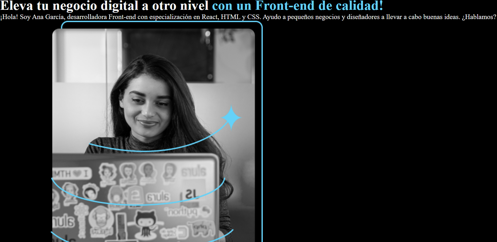
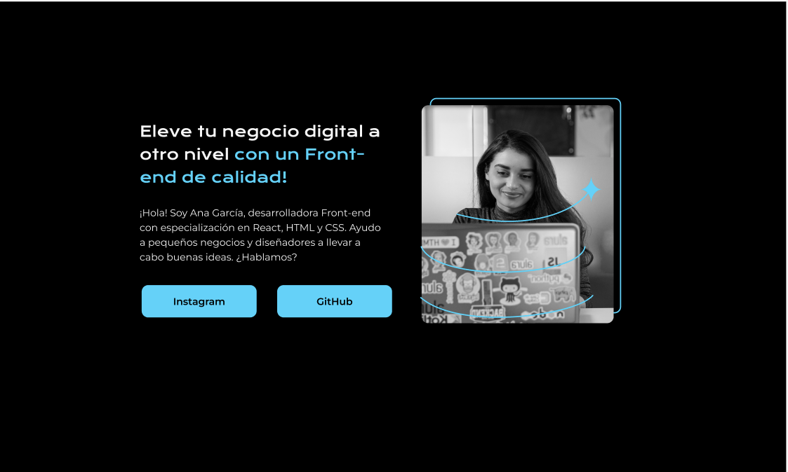
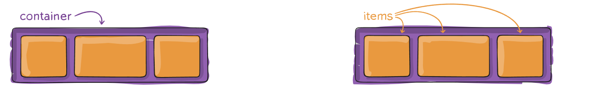
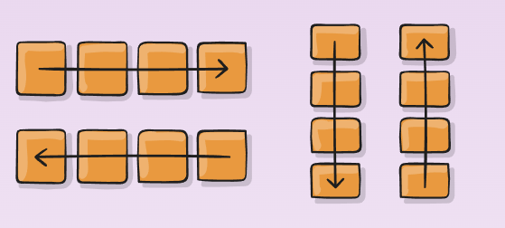
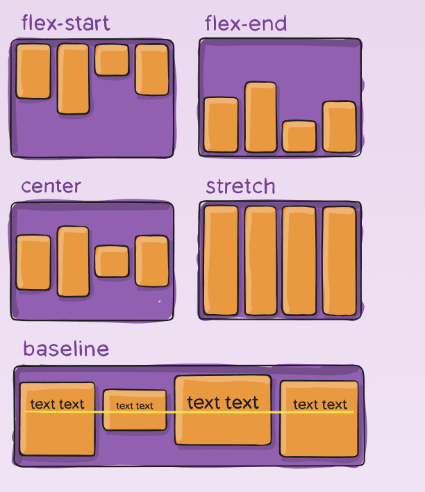
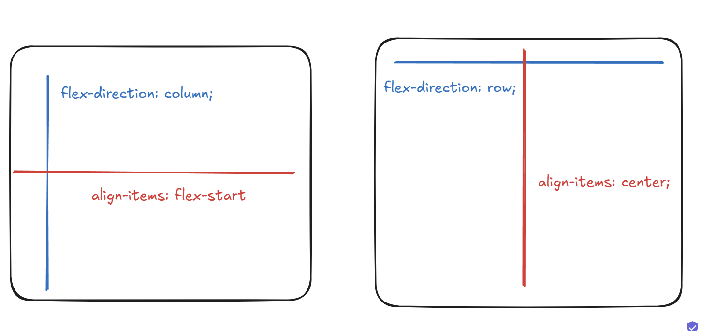

# Flexbox
tenemos una estructura en nuestra pagina pero no se parece a la que vemos en Figma

Actual 


Deseada


necesitamos empezar a posicionar nuestros elementos, para eso usemos el **`flexbox`** 

entonces antes que todo necesitamos el elemento padre y los elementos hijos


entonces si nos vamos a nuestro HTML vamos a ver que nuestra tag **`main`** contiene todos los elementos que podemos visualizar en la pantalla
por lo que este es nuestro *container* o *elementos padre* 

```html
    <main>
        <h1>
            Eleva tu negocio digital a otro nivel 
            <strong class="titulo-destaque">con un Front-end de calidad!</strong>
        </h1>
        <p>
            ¡Hola! Soy Ana García, desarrolladora Front-end con 
            especialización en React, HTML y CSS. Ayudo a pequeños 
            negocios y diseñadores a llevar a cabo buenas ideas. ¿Hablamos?
        </p>
        <a href= "https://www.instagram.com/">Instagram</a>
        <a href= "https://www.Github.com/">Github</a>
        
    </main>
```
enotnces creemos una clase dentro del main que lo identifiquem como el container, como practicamente todo lo que esta dentro del main es la presentacion de la persona entonces le colocamos "presentacion" 

```html
<main class="presentacion">
....
</main>
```

y en css copiamos algo llamado **`display:flex`**
```css
.presentacion{
    display:flex;

}

```
##### Explicacion del codigo: 
La propiedad `display` en CSS define cómo un elemento debe comportarse en términos de su visualización y su interacción con otros elementos. Algunos de los valores más comunes de la propiedad `display` son:

`block`: Hace que el elemento se comporte como un contenedor de bloque (ocupa toda la línea horizontal).

`inline`: Hace que el elemento se comporte como un contenedor en línea (solo ocupa el espacio necesario).

`none`: Oculta el elemento.

<mark>**`flex`**: Define el contenedor como un contenedor flexible (Flexbox).</mark>

Cuando usas `display: flex;`, estás activando el modelo Flexbox, que permite organizar y alinear elementos hijos de una manera muy flexible y poderosa, con propiedades como:

`justify-content`: Para alinear elementos horizontalmente.

`align-items`: Para alinear elementos verticalmente.

`flex-wrap`: Para permitir que los elementos se envuelvan.

##### Aplicacion de flexbox en nuestro codigo 
Si solo ponemos `display:flex` en nuestro elemento padre de *main*, nuestra pagina se vera asi 


**Se alinearon nuestros elementos**, porque sucede esto? 
Debido a estas dos propiedades
#### **`flex-direction`**
Dentro del modelo flexbox que acabamos de activar existe una propiedad llamada `flex-direction` y determina cómo se distribuyen los elementos (fila o columna). y ***está configurada por defecto para que los elementos se alineen horizontalmente o en otras palabras en fila (flex-direction:row)***

#### `align-items`
Esta es la propiedad responsable de cómo se alinean visualmente los elementos en el eje transversal.(eje de flex-direction)

**Si los elementos se ven alineados (hacia el centro, arriba, abajo, etc.), es gracias a align-items.**

#### Configuracion que se activo por defecto en este caso
```css
.container {
  display: flex;
  flex-direction: row; /* valor por defecto */
  align-items: stretch; /* valor por defecto*/
}
```

Los elementos se organizarán:

***En una fila horizontal (de izquierda a derecha)***, debido a `flex-direction: row`

***Ocupando todo el alto disponible debido a*** `align-items: stretch`: el valor real por defecto es stretch, lo que significa que los elementos dentro del contenedor flex **se estirarán para ocupar todo el alto del contenedor** (asumiendo que no tienen una altura definida).

Teniendo esto en cuenta...
#### Cual configuracion es la que necesitamos?

El `flex direction` y el `align-items` cuentan con estas configuraciones:

### flex-direction
```css
flex-direction: row | row-reverse | column | column-reverse;
```




----


### align-items
```css
align-items: stretch | flex-start | flex-end | center | baseline | first baseline | last baseline | start | end | self-start | self-end + ... safe | unsafe;
``` 


-----
#### Teniendo esto en cuenta... Cual de estas dos configuraciones debemos usar? 




