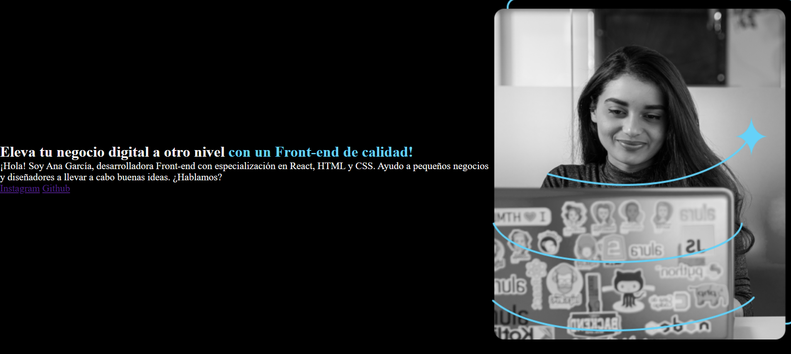
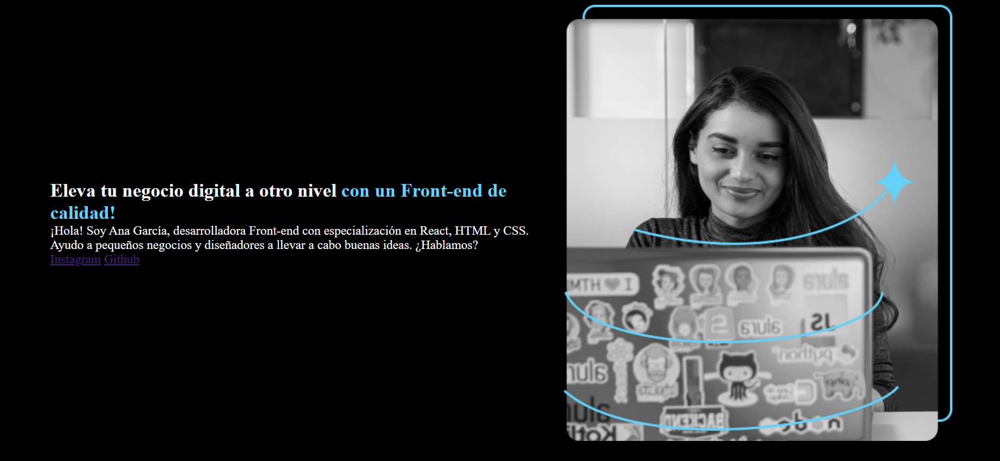
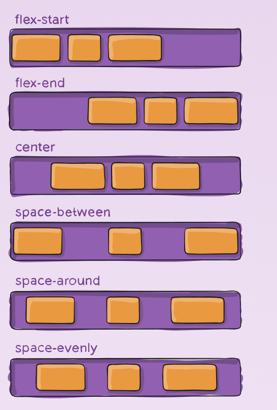
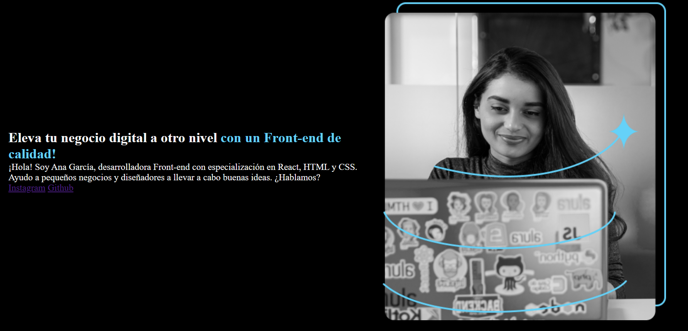

# Alineando el texto


como vemos en la foto nuestro texto esta muy pegado al borde por lo que debemos agregar espacio, como lo hacemos? añadiendo **margen** al contenido

```css
.presentacion{
    
    display:flex;
    flex-direction: row;
    align-items: center;
    margin:5% ;

}
```
miremos el cambio


ahora lo que queremos es que los elementos no esten tan pegados el uno del otro, que hacemos? 

### justify-content
esta propiedad del flexbox nos permite separar los elementos de varias formas: 


el que queremos es **space-between** 
entonces colocamos en nuestro codigo:

```css
.presentacion{
    
    display:flex;
    flex-direction: row;
    align-items: center;
    margin:5% ;
    justify-content:space-between;

}

```
y listo miremos como se ve ahora 


pero la letra es diferente a nuestro diseño figma
miremos como cambiarla en esta parte [[5.3b Estizando el texto.md]]