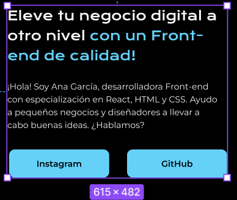
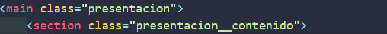
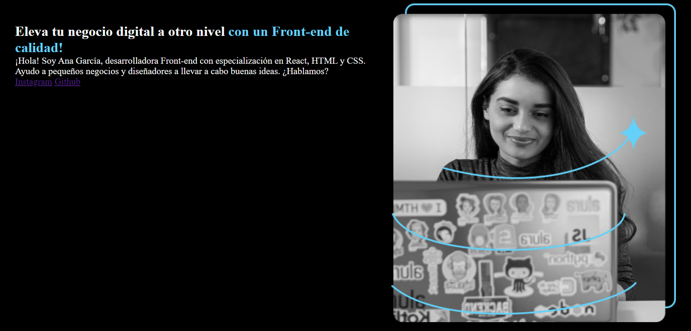
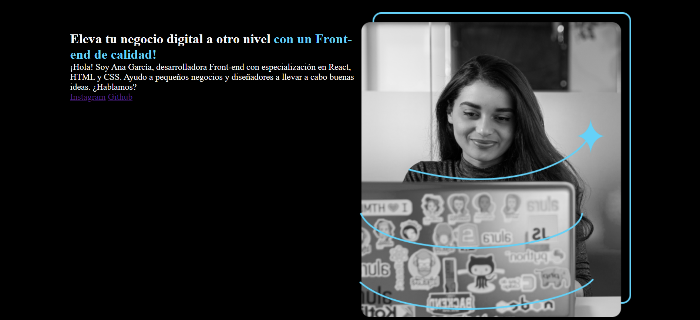

# Cambiando tamaño y posicion del texto
en nuestro figma vemos que nuestro texto tiene una cierta anchura y altura especifica miremos:
  

vamos a modificar esto en nuestro html:

recordemos que antes habiamos dicho que creamos una seccion o section especifica para nuestro texto y otra para la imagen es aqui donde modificaremos



demonos cuenta que le pusimos como nombre presentacion contenido ya que justamente esta seccion representa el texto o el contenido textual de la pagina

ahora en nuestro css modificamos lo siguiente
```css
.presentacion__contenido{
    width:615px;
    height:482px;
}
```
miremos el cambio


pero aun no se ve tan igual, aumentemos el margen para que el texto quede mas separado del borde

recordemos que lo teniamos en 5px ahora lo cambiamos a 10px y miremos: 


listo ahora se parece mas, pero las letras no son las mismas, vamos a realizar este cambio

primero, vemos que el titulo **no tiene la misma fuente** que en figma 

para esto creamos una clase en el h1 de nuestro html
`<h1 class="presentacion__contenido__titulo">`
 
 notese **el patron que siguen los nombres de las clases**, siempre ponemos de ***donde pertenece la etiqueta*** es decir a la section "presentacion__contenido", y tambien ***lo que representa la etiqueta*** que es el titulo.

 colocamos ahora en css esta clase y nos vamos a figma para averiguar cual es el tamaño y el nombre de la fuente

 vemos que es de tamaño 36 y de nombre "Krona One"

 por lo que en nuestro css agregamos la propiedad **`font-size`** el cual es el tamaño de la letra y le damos en **36px**

 ```css
 .presentacion__contenido__titulo{
    font-size:36px;

 }
 
 ```

ahora le cambiamos el tamaño al parrafo, y hacemos el mismo procedimiento

tamaño 24 - tipo de letra Montserrat
```css
.presentacion__contenido__parrafo{
    font-size: 24px;

}

```
listo se veria asi:


vemos que hemos avanzado pero no tenemos la misma fuente, lo aprenderemos en [[5.3c Importando las fuentes.md]]

