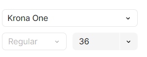

# Cambiando las fuentes del texto

Para utilizar las fuentes que tenemos en Figma, primero necesitamos importarlas de algún lugar. 

en Figma, hacemos clic en el H1, y en la tabla I, que está a la derecha, en la tabla de diseño, aparece el tipo de fuente que estamos utilizando, que es la Krona One.

Buscamos en Google fonts nuestras fuentes y las importamos

algo importante es el **peso de la fuente** que se refiere a lo que vemos aca abajo


y en figma vemos que efectivamente es regular


entonces la descargamos asi:
nos vamos a get font, luego a get embed code y damos clic en la parte de import, y tomamos solamente el @import de la etiqueta style 


ahora con ese link lo introducimos en nuestro css al principio de todo 


### Como activamos la fuente? 
en el mismo apartado de importar vemos que nos dicen como usar la fuente:


copiamos y pegamos en el css de nuestro titulo este codigo

y se veria asi nuestro titulo


ahora hacemos lo mismo con la fuente del parrafo que es montserrat pero con esta fuente pasa algo particular

### Pesos de fuentes
existen tipos de fuente que tienen mas de un peso, como semibold, bold, etc. en este caso la fuente montserrat tiene muchos pesos pero el que necesitamos es regular si vemos en figma

entonces no pasa nada, si vemos aparece todo en full axis, nosotros copiamos el link de importacion y en el mismo css especificaremos el peso que usaremos


ahora si nos fijamos, este link de importacion ya tiene incluido la primera fuente importada krona one

@import url('https://fonts.googleapis.com/css2?family=Krona+One&family=Montserrat:ital,wght@0,100..900;1,100..900&display=swap');

esto es debido a que google fonts nos va guardando en el historial todas las fuentes descargadas, entonces quitamos el primer link que pusimos en css ya que con este solo tenemos las dos fuentes 

y copiamos el codigo para activar la fuente y la pegamos dentro del css del parrafo

```css
.presentacion__contenido__parrafo{
    font-size: 24px;
    font-family: "Montserrat", serif;
}
```
miremos como se ve todo


ahora solo nos faltan los botones de las redes sociales, lo cual aprenderemos en la seccion 
[[5.4a Posicionando los botones]]
