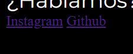
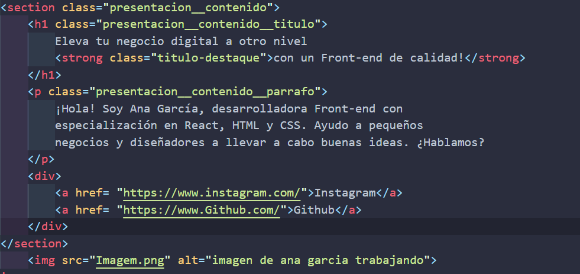
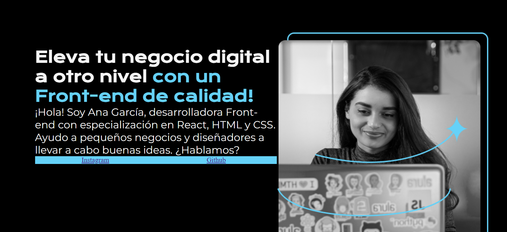
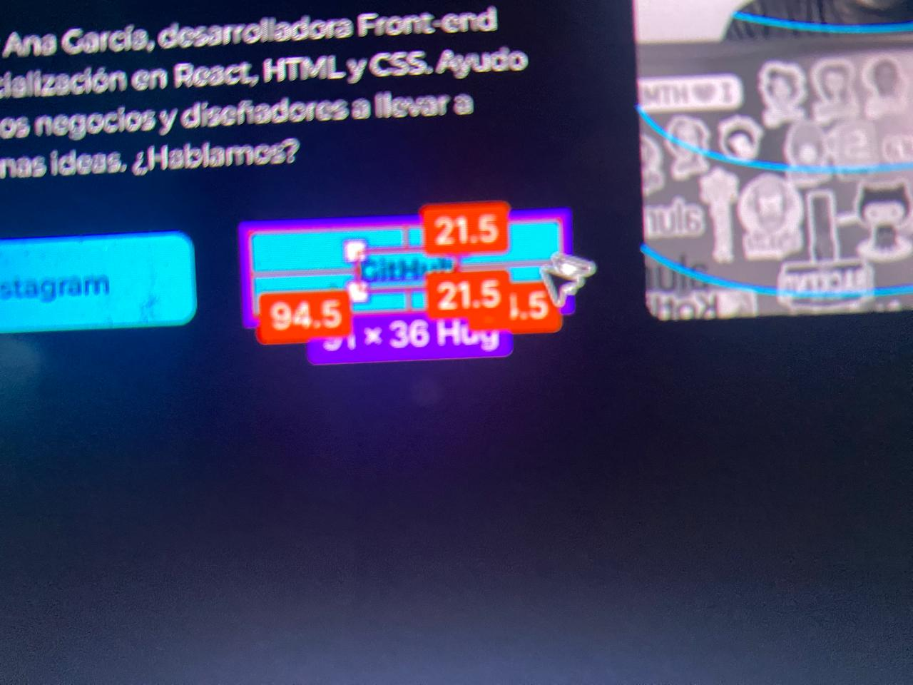
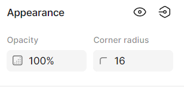
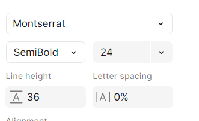
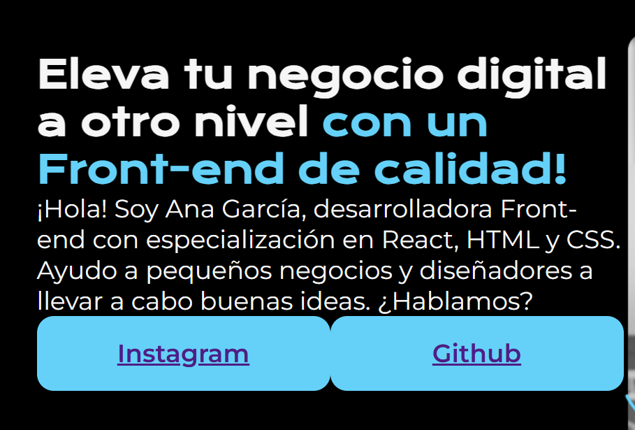
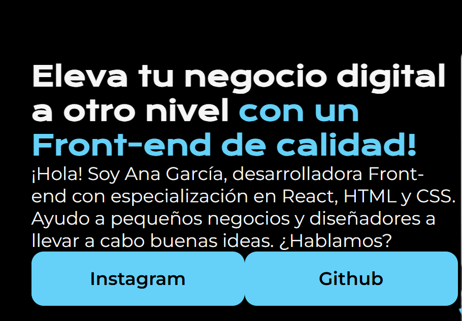

# Div
La etiqueta div nos funciona para hacer *divisiones* en el apartado visual de nuestra pagina, no se trata de una etiqueta semantica que como recordamos estan hechas para definir especificamente lo que contienen o su funcion 
ejem:
`<header>` indica que es un encabezado.
`<article>` señala que es un artículo independiente.
`<footer>` indica un pie de página.

la diferencia mas notable es que el div es un contenedor generico y lo usamos para **agrupar elementos que estan dentro de cualquiera de estas etiquetas semanticas**
mientras que las etiquetas semanticas ya tienen un proposito definido y un significado asociado a lo quee contienen

## Uso en nuestro codigo 
en este caso **vamos a hacer una division en donde queremos agrupar nuestros enlaces de redes sociales para que se apliquen cambios especificos solo a estos elementos**

Que cambio queremos hacer?
***queremos separar estos enlaces porque estan muy pegados***



PERO
primero preguntemonos porque usamos div y no usamos section si ambos tienen propositos de agrupar? 

antes habiamos usado `<section>` para crear una argupacion pero la diferencia es que con `<div>` hacemos agrupaciones de elementos que no tienen significado entre si y por lo tanto esta etiqueta no tiene significado para los navegadores en cambio con `<section>` agrupamos contenido relacionado dentro de una página y los navegadores lo interpretan de esa forma, como cuando creamos la section para el contenido textual. 

#### Resumen diferencia entre `<section> y <div>`
Usa `<section>` si estás marcando una parte del contenido con un propósito definido, como "este es el texto principal de mi página".

Esto le da un contexto semántico al contenido.

Ejemplo: "Esta es la sección de texto que explica la historia de la empresa".
Usa `<div>` si solo necesitas organizar elementos sin que necesariamente tengan un significado temático.

Ejemplo: "Agrupo una imagen y un botón para darles estilos".

**Pero** si en algún momento tienes un conjunto de elementos en un `<div>` que empiezan a tener un propósito común, puedes reemplazarlo por una etiqueta semántica como `<section>` o `<article>`. Así, tu código será más claro y semánticamente correcto.

## Creacion de los botones de instagram y github
miremos como empleamos en html esta etiqueta: 


OJO nos falta algo, **recordemos que siempre debemos colocarle un nombre de clase al elemento de html para poder modificarlo en css**

```html
<div class="presentacion__enlaces">
    <a href= "https://www.instagram.com/">Instagram</a>            
    <a href= "https://www.Github.com/">Github</a>
</div>
    
```
y ahora modificamos en css para realizar la separacion como ya sabemos.

```css
.presentacion__enlaces{
    display:flex;
    justify-content:space-between;
}

```

pero ahora haremos otra clase y **esta clase la usaremos en cada enlace**

```html
<div class="presentacion__enlaces">
    <a class="presentacion__enlaces__link" href= "https://www.instagram.com/">Instagram</a>            
    <a class="presentacion__enlaces__link" href= "https://www.Github.com/">Github</a>
</div>
    
```
ahora creemos las modificaciones para estos dos links para que se conviertan en botones 

```css
.presentacion__enlaces__link{
    width: 280px;
    background-color: #22D4FD;
    text-align: center;

}


```
demonos cuenta que lo primero que hacemos es aumentar la anchura de cada ancla para que halla cierta separacion en las palabras "instagram" y "github", ademas ponemos el color de fondo para cada uno de los botones y alineamos las palabras en el centro del fondo azul




### Separacion de la letra y el borde del boton 

Ahora lo que haremos sera añadirle la separacion entre la letra y el borde y esto es el padding

**Para poder ver el valor del padding en figma oprimimos Alt mientras mantenemos el cursor en el padding de la letra**



*Demonos cuenta que el padding no es uniforme, existe un padding vertical y otro horizontal, 

Que hacemos?

Incluimos los dos valores, el primer valor sera el vertical y el otro el horizontal, pero como no queremos que haya mas separacion horizontal simplemente colocamos el valor en 0
```css
.presentacion__enlaces__link{
    width: 280px;
    background-color: #22D4FD;
    text-align: center;
    padding: 21.5px 0;

}
```

### Curvatura del borde
ahora fijemonos que estos botones tienen una curvatura en los bordes, nos vamos a figma y fijemonos de la caracteristica *"corner radius"*



usaremos este valor en una propiedad nueva llamada **`<border-radius>`**

```css
.presentacion__enlaces__link{
    width: 280px;
    background-color: #22D4FD;
    text-align: center;
    padding: 21px 0;
    border-radius: 16px;

}
```
### Cambiando fuente
coloquemos la fuente original de estos botones

entonces fijemonos que es el mismo Montserrat pero tenemos algo distinto, el peso de la fuente ya no es regular sino que es *SemiBold* 

por lo que debemos buscar el peso de esta fuente y colocarla con la propiedad **`font-weight`**

```css
.presentacion__enlaces__link{
    width: 280px;
    background-color: #22D4FD;
    text-align: center;
    padding: 21px 0;
    border-radius: 16px;
    font-family: "Montserrat", serif;
    font-size: 24px;
    font-weight: 600;
}
```

miremos como se ve 


ahora nos faltan dos modificaciones: 

## Cambiando el color y la decoracion de "hipervinculo" del texto del boton

el color lo cambiamos como ya sabemos, con la propiedad `color` le ponemos color negro y para quitar este subrayado que vemos usaremos una nueva propiedad: `text-decoration` con el valor de **none** ya que no queremos que haya nada en el texto

```css
.presentacion__enlaces__link{
    width: 280px;
    background-color: #22D4FD;
    text-align: center;
    padding: 21px 0;
    border-radius: 16px;
    font-family: "Montserrat", serif;
    font-size: 24px;
    font-weight: 600;
    color: #000000;
    text-decoration: none;
}

```


