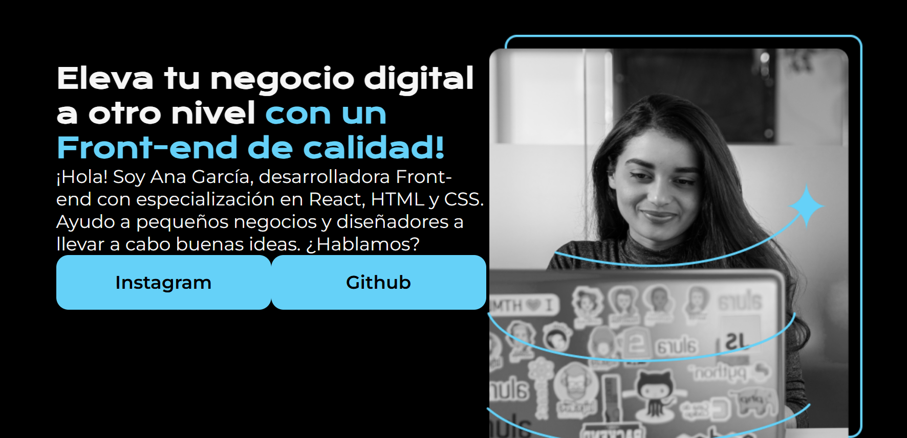

# El recurso Gap
Esta propiedad de CSS lo que hace es especificar el tamaño de los espacios entre filas y columnas en diseños de cuadrícula, flex y de varias columnas. Su sintaxis es bastante simple y acepta uno o dos valores.

nuestra pagina actualmente se ve asi 


pero vemos que las cosas estan muy pegadas

asi como vimos que el *padding* podia tener valores tanto para la parte vertical como para la horizontal, el ***margin*** tambien puede tenerlos entonces agregamos 15% de espaciado horizontal

```css
.presentacion{
    display:flex;
    flex-direction: row;
    align-items: center;
    margin: 10% 15%;
    justify-content: space-between;
}
```

pero aqui modificaremos algo mas, en este caso el justify-content **no es suficiente para separar** las 2 secciones de la pagina que son el contenido textual y la imagen, entonces buscamos en figma cual es su separacion

vemos que es de 70px, pero que hacemos con esta informacion? usaremos el recurso **`gap`** el cual nos permite separar elementos de forma sencilla 

```css
.presentacion{
    display:flex;
    flex-direction: row;
    align-items: center;
    margin: 10% 15%;
    gap: 70px;
}
```


pero vemos que nuestros elementos en la seccion textual estan muy pegado entonces modifiquemoslo tambien con la info de figma, aqui nos muestran que la separacion entre el titulo y el parrafo es de 40px entonces lo modificamos

```css
.presentacion__contenido{
    width: 615px;
    display: flex;
    flex-direction: column;
    gap: 40px;
}
```


