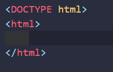
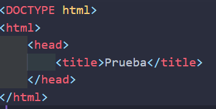
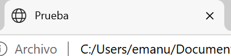
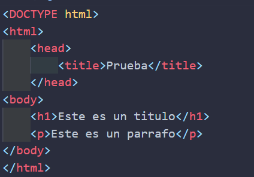
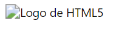

# Documentación y estructura de HTML
## Documentación básica
Una parte fundamental del aprendizaje de HTML es estar al dia con la documentación para profundizar lo que vamos aprendiendo en el curso, un sitio muy popular para acceder a esta es:

* [w3schools](https://www.w3schools.com/html/html_intro.asp): es una web muy popular para principiantes que desean conocer la documentacion de forma sencilla y con tutoriales y ejemplos practicos.
<br>
* [W3C/WHATWG](https://html.spec.whatwg.org/multipage/#toc-introduction): Es la fuente oficial de las especificaciones técnicas de HTML.
Es más técnica y detallada, ideal para desarrolladores avanzados y expertos.


en este caso trabajaremos con la primera fuente (w3schools) 

## Estructura basica de html
Primero realizamos nuestro primero codigo 

`<DOCTYPE html>`

Para que sirve esta etiqueta?  
para decirle a nuestro navegador que estamos trabajando con HTML5 la cual es la ultima version de html

ahora colocamos nuestra etiqueta raiz: 


como vemos son iguales las tag pero tienen la diferencia de que una es de apertura y otra es de cierre ademas vemos que hay un espacio entre las dos, se aplico un espacio de un tab para que nuestro codigo sea mas legible.

ahora todo lo que escribiremos vendra dentro de estas dos etiquetas

a continuacion creamos lo que vendria en nuestro orden estructural: el 
**head**, el cual es la "cabeza" de nuestro programa y adentro de este head colocamos el titulo principal


como observamos siempre se sigue la regla de espacio de un tab, esta palabra sera la que aparezca en nuestra pestaña 


ya creamos nuestra cabeza y como se ve ella con el *title*, ahora nos falta el cuerpo, el **body**

aqui es donde ya empezaremos a darle cambios al espacio de nuestra pagina como tal

incluimos dentro del body lo que queremos que se muestre, es aqui donde añadimos el `h1` que seria nuestro titulo principal de la pagina (OJO solo podemos añadir uno, asi que procuremos que sea descriptivo). Luego añadimos el `p` que seria el *parrafo* de nuestra pagina



### Como añadimos una imagen?
usaremos una etiqueta diferente esta vez ya que no tiene cierre y escribimos dentro de esta y no afuera como las otras

```html

```
como vemos tambien incluimos algo llamado `src`(source) lo cual es una propiedad de la etiqueta que significa la fuente de nuestra imagen, pero que pasa si queremos que la imagen tenga una descripcion? entonces usamos la etiqueta `alt` 

```html

```

de esta manera cuando la imagen no aparezca por alguna razon se dara una descripcion de esta 

