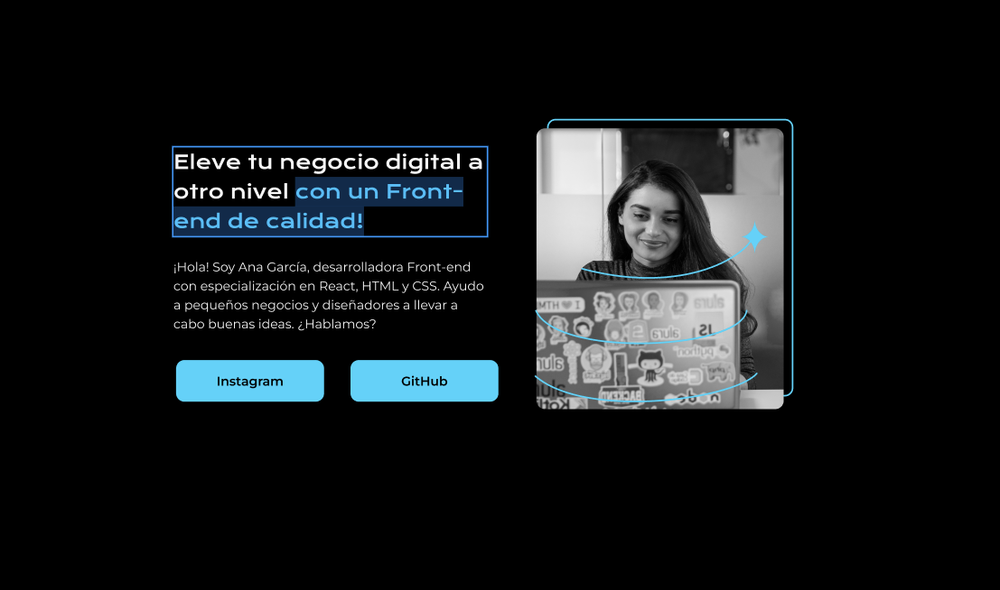
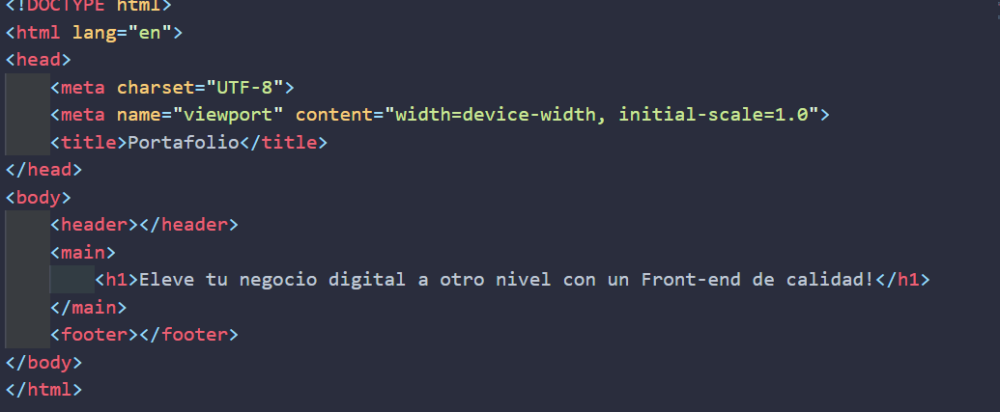
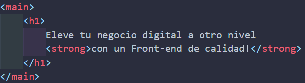

# Usando Figma para crear nuestro HTML
## Escribiendo el titulo
teniendo ya cargado nuestro diseño en Figma el cual usaremos para hacer nuestro html, lo primero que haremos sera colocar un titulo:



entonces miremos que el titulo no se encuentra en el header sino en el *main* ya que esta en el medio, copiamos la frase 

entonces nos vamos al html y colocamos en la parte de main un h1 con nuestra frase (recordemos que va en la parte de body ya que es el body lo que se muestra en pantalla)


pero, demonos cuenta que la frase tiene un resaltado, asi que reflejemos eso en nuestro codigo
usando la etiqueta `<strong>`



pero no va a salir nada nuevo en nuestra pagina por ahora, estos es solo para que el navegador sepa que hay algo diferente en este titulo

## Escribiendo el parrafo
hacemos lo mismo pero con un p 
```html
<p> ¡Hola! Soy Ana García, desarrolladora 
    Front-end con especialización en React, 
    HTML y CSS. Ayudo a pequeños negocios y 
    diseñadores a llevar a cabo buenas ideas. 
    ¿Hablamos?
</p>

```
pero ahora vemos que hay una especie de botones que nos llevan a instagram o a github, justo esta definicion, de algo que nos lleva a un lugar es lo que llamamos en HTML como un **ancla** y es uno de los tipos de botones existen en html

Las etiquetas son diferentes en ambos aspectos y es necesario saber utilizar cada una en su función correcta. Mientras que `<button>` se puede utilizar para acciones como enviar formularios, la etiqueta `<a>` no tiene esa funcionalidad, ya que su papel es simplemente redirigir al usuario a diferentes URLs.

#### Estructura basica de ancla
`<a href="URL">Texto del enlace</a>
`

`href`: Especifica la URL del destino al que la ancla apunta.
#### Ejemplo
```html
<a href= "https://www.instagram.com/">Instagram</a>
<a href= "https://www.Github.com/">Github</a>
```


## Como colocar una imagen en html? 
lo realizamos con el siguiente codigo
`
```


