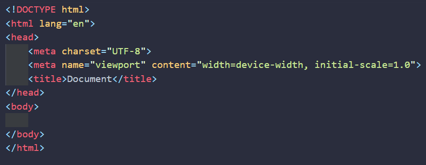
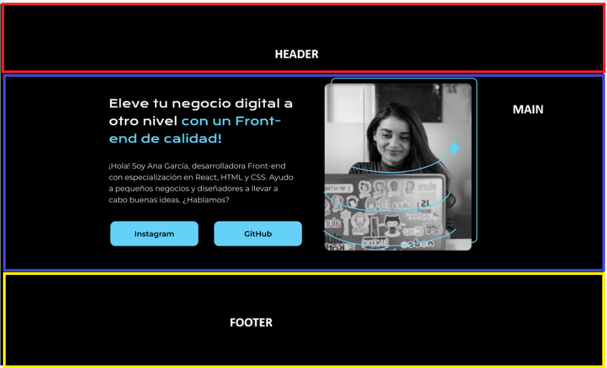
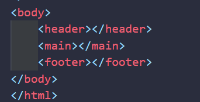

# Etiquetas Semanticas 
Existen ciertas abreviaturas o atajos que nos permiten ahorrarnos tiempo escribiendo codigo

En nuestro primer caso abordaremos abreviaturas para HTML y una de ellas es el simbolo: `!`
este signo de exclamacion al ejecutarlo nos brinda esta estructura: 

como vemos existen cosas nuevas que no conocemos desglosemoslas:
* `<html lang= "en"> ` : en este codigo vemos la propiedad *lang* que se refiere al lenguaje en el
que mostraremos nuestro html, como lo estamos haciendo en español, en lugar de *"en"* colocamos *"es"*.
 
* `<meta charset="UTF-8">`: `<meta>`Es una etiqueta HTML utilizada para proporcionar metadatos sobre el documento,
  como la codificación de caracteres, la descripción, palabras clave, y otra información útil para los navegadores y motores de búsqueda.
  `charset` vendria siendo un atributo de `<meta>` que indica la codificacion de los caracteres y `UTF-8` es una de las codficaciones de caracteres mas utilizados en el mundo de html
 
*`<meta name="viewport" content="width=device-width, initial-scale=1.0">`: aqui vemos varias cosas,
  el `"viewport"` seria toda la parte visual de la pantalla que se logra ver
  cuando colocamos `name` estamos especificando que esta etiqueta está configurando el "viewport", es decir, 
  el área visible de una página web en un dispositivo. 
   
  El atributo `name="viewport"` le dice al navegador que el contenido dentro del atributo content contiene 
  configuraciones específicas para controlar el tamaño y el comportamiento del viewport. Sin esta 
  declaración, los navegadores móviles utilizan un ancho de viewport predeterminado más amplio (normalmente 980px), 
  que no siempre se adapta bien a pantallas pequeñas.
   
  por ejemplo el `width=device-width` lo que quiere decir es que el ancho de la pagina se ajustara al dispositivo
  que se este usando ya sea celular o computadora y el `initial-scale=1.0` significa que la pantalla
  no tendra zoom al iniciarse

## Las 3 partes fundamentales de un HTML
estas son: el header, el main y el footer

y estas etiquetas son las que modifican lo que vemos dentro de la pagina, es decir en nuestro *body*
  

ahora que sabemos esto empecemos a modificar nuestra pagina [[4.3c Desarrollando el HTML.md]]